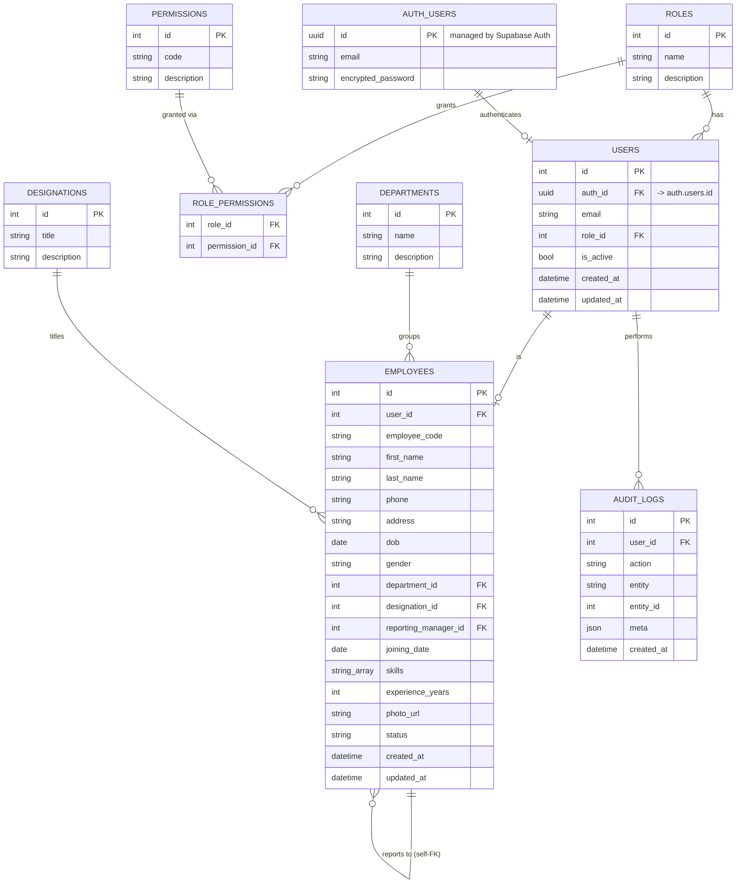

# HRMS — Entity Relationship Diagram

This covers the **Foundation** schema only (auth, roles/permissions, employees,
departments, designations, audit logs). Each later phase (Attendance, Leave,
Payroll, Projects, Tasks, Recruitment, Assets, Documents, Announcements) adds
its own tables + migration and extends this diagram.

Credentials live in Supabase Auth's `auth.users`; `public.users` holds the app's
own identity (integer id, role, active flag) and points at it via `auth_id`.

## Notes

- `users` holds auth identity (email/password/role); `employees` holds HR
  profile data and is 1:1 with `users` via `user_id`. Every employee is a
  user, but not every future user (e.g. a service account) needs to be an
  employee — hence the separate tables rather than one merged one.
- `employees.reporting_manager_id` is a self-referencing FK for the org
  hierarchy used by the reporting-manager field and (later) approval chains.
- `refresh_tokens` stores only a SHA-256 hash of the token, never the raw
  value, and is rotated on every `/auth/refresh` call.
- `audit_logs.meta` is a JSON column for action-specific context so the table
  doesn't need a migration every time a new auditable action is added.
